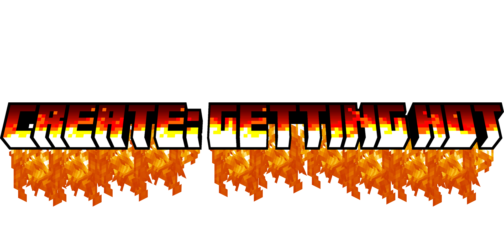

<table width="100%">
  <tr>
    <td width="20%" align="center">
      
    </td>
    <td width="80%">
      <h1>Create: Getting Hot</h1>
      
Аддон для модификации Create, посвященный термодинамике и теплогенерации

    </td>
  </tr>
</table>

  

**Create: Getting Hot** — это неофициальный аддон для технической модификации *Create*, который расширяет механику взаимодействия с температурами, теплогенерацией и термодинамикой. 

> [!NOTE]
> Данный мод находится в активной разработке. Базовая заготовка создана на основе официального шаблона NeoForge MDK.

---

## 🤝 Вклад в разработку (Contributing)

Мы рады любой помощи! Если вы нашли баг или хотите предложить новую механику:
1. Создайте **Issue** с подробным описанием.
2. Сделайте **Fork** репозитория, внесите изменения и отправьте **Pull Request**.